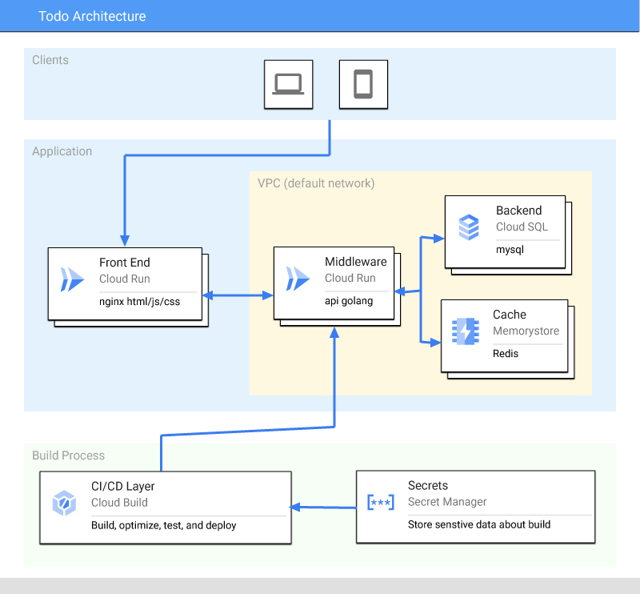

# Deploy Stack - Three Tier App (Todo) 

This is a simple todo application written in containers that uses a MySQL 
backend along with Redis Caching to drive a API and a frontend that powers
a simple little Todo application.  It also spins up Google Cloud infrastructure
to power the application. 

## Install
You can install this application using the `Open in Google Cloud Shell` button 
below. 

Clicking this link will take you right to the DeployStack app, running in your 
Cloud Shell environment. It will walk you through setting up your architecture.  

## Cleanup 
To remove all billing components from the project
1. Typing `deploystack uninstall`

## Development
There is a development setup for this application that uses Docker to run 
everything you need to developer and test it out locally. 

To run:
1. Open a terminal on your local system. 
1. `cd code`
1. `make dev`

This will spin up 4 containers
1. MySQL /database
1. Redis
1. Golang API /middleware
1. Static HTML/JS/CSS site /frontend

This is not an official Google product.
